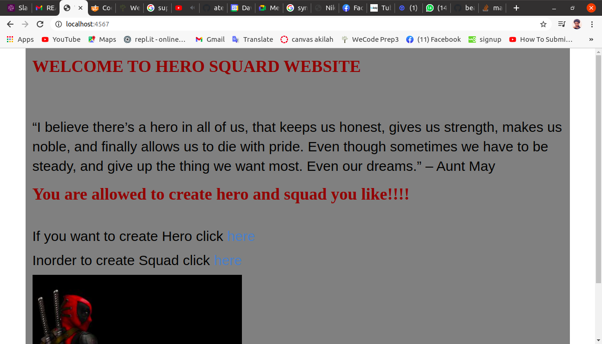

## Author: Beatrice Shabani
## Description:
This is an app that enables a user create a hero and a squad and also the user can add a hero to a squad

## Instructions
Create an app that allows you to recruit a well-balanced team of superheroes (or any other character-type of your choosing).

Create a Hero object: At the very least, they should have a name, age, special power and weakness. Special powers and weaknesses could be freely assignable or you may offer users a pre-determined set to choose from.

Create a Squad object: They should have a max size, name, and a cause they're are dedicated to fighting (sexism, computer illiteracy, not covering your mouth when you sneeze, hogging bus seats with your backpack, passive-aggressive post-it notes, etc).

Allow users to assign Heros to a Squad. Each hero can only participate in one Squad at a time.

You could even calculate scores for a specific skill area for your squad (defense, distance attacks, etc), or begin to integrate a turn-based battle system. Get creative! This could be the start of a fun portfolio piece!

## Prerequisites
in order to use this app you need

$ java
$ JDK - Java Development Kit
$ Maven
$ Gradle
$ An IDE - Intellij

## DEMO

